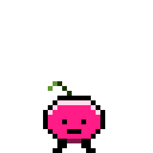

 ============\\============ 
 
 
============\\============

 

 
 
 ============\\============ 
 Christian ✝️❤️🙏 
 Languages 🌠Programming Languages 💻  
 Cute things 🌸🶠Chaves && Chapolin 📺🥸 
============\\============

